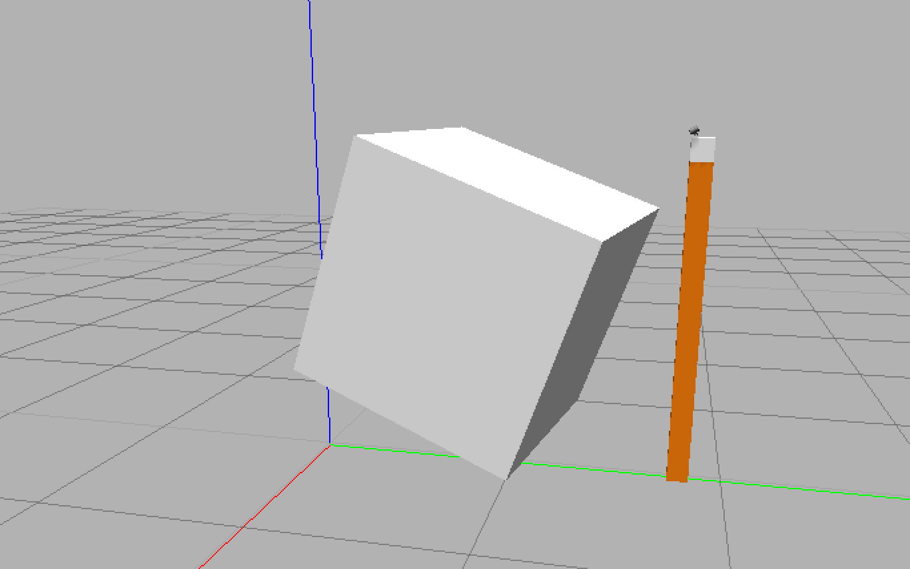

# 3D Perception Project

## Project Pipeline

### Training
We start by creating an SVM model by training on the dataset. We generate our dataset using `capture_features.py`.
Training with the default parameters gives us a confusion matrix that looks like this:

Confusion Matrix with random input
<p float="left">
  
  
</p>

I then set up the training pipeline and trained it on RGB data. There was progress, but not enough.

###### Confusion Matrix with RGB input
<p float="left">
  
  
</p>

After training again with HSV instead of RGB we see that the model starts performing better. In `capture_features.py`, we see that there's a loop that runs five times. Turns out it's for the number of orientations of the object you want to scan. I increased it to 60 orientations just to see how it would perform.

###### Confusion Matrix with HSV input
<p float="left">
  
  
</p>

The model performed far better. Since there was high correlation between training and test datasets, the C parameter didn't require fine tuning. I included a picture in the figures folder.

I then took a look at all pick lists in the projects workspace and listed those items in `capture_features.py` in the training workspace. I thought the model would lose some performance since the number of labels increased but the model did pretty well

###### Confusion Matrix tuned with HSV input trained with 100 orientations on the project dataset
<p float="left">
  
  
</p>

### Perception

For the perception pipeline I had changed the `project_template.py` filename to `perception.py` and started adding steps to it.

#### Statistical Outlier Filter

Unlike the exercises, the project simulator simulates a real world sensor, which generally has noisy input data. The input point cloud from the camera looks like this


To get rid of the noise we apply a statistical outlier filter which then gives a much better point cloud with no perceivable noise.

#### Voxel Grid Downsampling

To reduce pointcloud complexity, I downsampled the point cloud using voxel grid downsampling. I started with a `leaf_size` value of 1, which took out almost all points in the cloud. I then kept tuning it till I felt like 0.05 was good.


#### Passthrough Filter

A Passthrough filter is essentially a crop tool to crop out our region of interest. I used relevant axis values for x, y and z to crop out just the table with our items on it.


#### RANSAC Plane Fitting

We then crop out the table by using the RANSAC algorithm to fit a plane and extract outliers and inliers.


#### Euclidean Clustering

We then cluster points to detect objects based on the density of the pointcloud. I then applied a color mask to the detected objects. This gives us a point cloud that looks like this


#### Publishing ROS topics
At this point we have a lot of data that needs to be broadcasted. We send it using the `pcl_to_ros` function.

#### Object Detection (Inference)
We have the model and clustered point clouds, now I iterated over the individual clusters and then used the trained SVM model to classify the object and then assign a label to it. We then add these detected object point clouds with their labels to a list that is then passed to `pr2_mover`

#### Output `.yaml` files
I feel the main learning point of this part of the project is properly understand the sequence of how this happens. We're supposed to output a `.yaml` file that has a list of objects from the `pick_list.yaml` file, but also includes coordinates of where the object is and where it needs to be placed. So we first begin by iterating over the pick list, then finding the object in the list of detected objects. We then calculate the centroid for the detected object's pointcloud and update `pick_pose`, check which box it belongs to based on the color information from the `pick_list.yaml` file and update `place_pose` and also update the name of the arm used to pick it up.

This results in a yaml file that looks like this
```
object_list:
- arm_name: right
  object_name: biscuits
  pick_pose:
    orientation:
      w: 0.0
      x: 0.0
      y: 0.0
      z: 0.0
    position:
      x: 0.5415201783180237
      y: -0.24123623967170715
      z: 0.7053418755531311
  place_pose:
    orientation:
      w: 0.0
      x: 0.0
      y: 0.0
      z: 0.0
    position:
      x: 0
      y: -0.71
      z: 0.605
  test_scene_num: 1
- arm_name: right
  object_name: soap
  pick_pose:
    orientation:
      w: 0.0
      x: 0.0
      y: 0.0
      z: 0.0
    position:
      x: 0.5415201783180237
      y: -0.24123623967170715
      z: 0.7053418755531311
  place_pose:
    orientation:
      w: 0.0
      x: 0.0
      y: 0.0
      z: 0.0
    position:
      x: 0
      y: -0.71
      z: 0.605
  test_scene_num: 1
- arm_name: right
  object_name: soap2
  pick_pose:
    orientation:
      w: 0.0
      x: 0.0
      y: 0.0
      z: 0.0
    position:
      x: 0.5447329878807068
      y: -0.018509099259972572
      z: 0.6769031286239624
  place_pose:
    orientation:
      w: 0.0
      x: 0.0
      y: 0.0
      z: 0.0
    position:
      x: 0
      y: -0.71
      z: 0.605
  test_scene_num: 1
```

##### Test Scene Numbering
It is important to keep track of scene number in both `perception.py` and `pick_place_project.launch` files. Make sure you edit in both places in `pick_place_project.launch` and `test_scene_num.data` in `perception.py` to match.

### Pitfalls and Conclusions

The project was pretty straightforward to implement once the exercises were done. There were a few pitfalls encountered alonf the way though

VMWare Fusion: Note to MacOS users: Please purchase it if you are planning to use it for longer than the trial period. I tried working with VirtualBox without knowing the advantages and speed of VMWare Fusion's graphics. The extra time you will spend on VirtualBox for these projects will cost more than the price to purchase VMWare Fusion.

ROS file structure: The folder structure for `sensor_stick` was confusing at times and resulted in weird outcomes


In an age where everybody reaches out to Neural Networks as an immediate fix/starting point for a Machine Learning task, SVMs always seem to surprise me with their performance. Though it skipped a few coordinate updates, the algorithm classified all objects perfectly in all test scenes on the first try after training the model.
